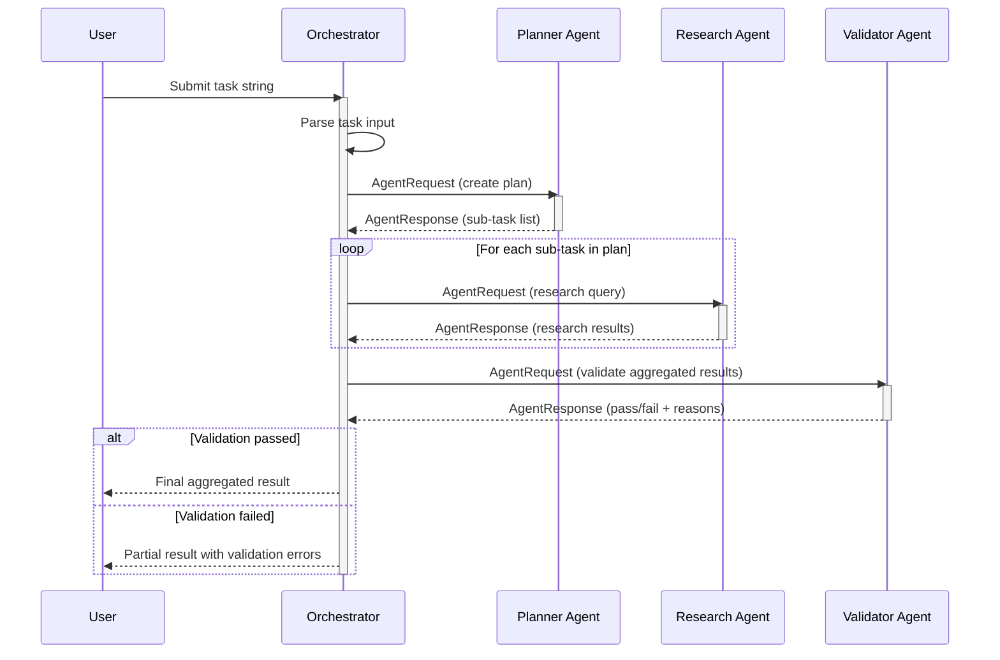
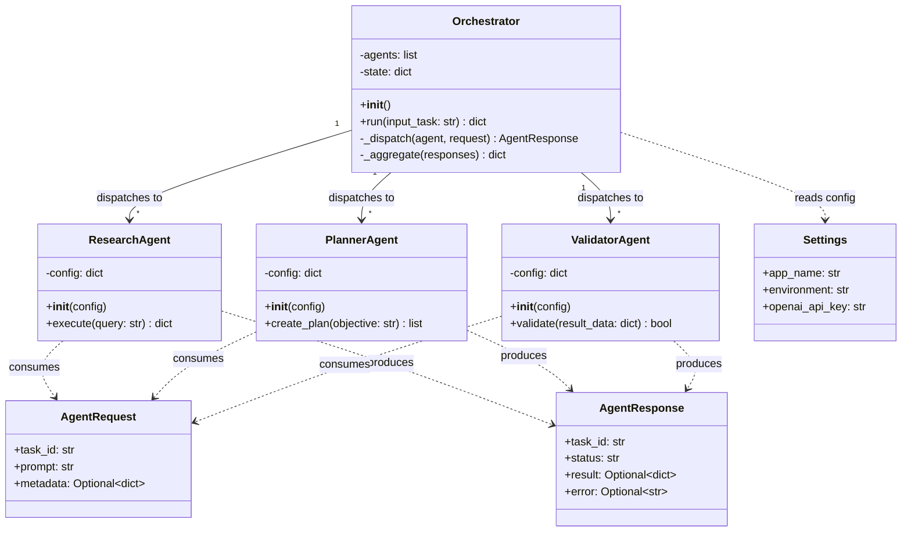

# Architecture Design Document

## Multi-Agent AI System

---

| Field | Details |
|---|---|
| **Document Version** | 1.0 |
| **Date** | [DD/MM/YYYY] |
| **Prepared By** | [Student Name 1], [Student Name 2], [Student Name 3] |
| **Faculty Guide** | Prof. [Faculty Name] |

---

## 1. System Overview

The Multi-Agent AI System follows an orchestrator-agent architecture in which a central Orchestrator coordinates specialised autonomous agents to decompose, execute, and validate complex tasks. This design emphasises modularity, extensibility, and separation of concerns.

---

## 2. Architecture Diagram

> *[Replace the text diagram below with a polished exported image at `diagrams/exports/architecture_diagram.png`]*

```
┌────────────────────────────────────────────────────────────────────┐
│                           USER INPUT                               │
│                        (CLI / API Call)                             │
└────────────────────────────┬───────────────────────────────────────┘
                             │
                             ▼
┌────────────────────────────────────────────────────────────────────┐
│                        ORCHESTRATOR                                │
│                                                                    │
│   ┌──────────────┐   ┌───────────────┐   ┌──────────────────┐     │
│   │  Task Parser  │   │ Workflow      │   │ State Manager    │     │
│   │               │──▶│ Engine        │──▶│ & Error Handler  │     │
│   └──────────────┘   └───────────────┘   └──────────────────┘     │
│                                                                    │
└──────┬──────────────────┬──────────────────────┬───────────────────┘
       │                  │                      │
       │ AgentRequest     │ AgentRequest         │ AgentRequest
       ▼                  ▼                      ▼
┌──────────────┐   ┌──────────────┐   ┌────────────────────┐
│  RESEARCH    │   │  PLANNER     │   │   VALIDATOR        │
│  AGENT       │   │  AGENT       │   │   AGENT            │
│              │   │              │   │                    │
│  - Web/API   │   │  - Task      │   │  - Schema check   │
│    retrieval │   │    decomp.   │   │  - Quality rules  │
│  - Context   │   │  - Step      │   │  - Safety checks  │
│    building  │   │    ordering  │   │                    │
└──────┬───────┘   └──────┬───────┘   └────────┬───────────┘
       │                  │                      │
       │ AgentResponse    │ AgentResponse        │ AgentResponse
       ▼                  ▼                      ▼
┌────────────────────────────────────────────────────────────────────┐
│                     SHARED MODULE                                  │
│                                                                    │
│   ┌────────────┐   ┌────────────────┐   ┌──────────────────┐      │
│   │ schemas.py │   │   utils.py     │   │   config.py      │      │
│   │ (Pydantic) │   │ (Logging,      │   │ (Settings,       │      │
│   │            │   │  Retry logic)  │   │  Env Variables)  │      │
│   └────────────┘   └────────────────┘   └──────────────────┘      │
│                                                                    │
└────────────────────────────────────────────────────────────────────┘
                             │
                             ▼
                   ┌──────────────────┐
                   │  EXTERNAL APIs   │
                   │  (LLM, Search,   │
                   │   Data Sources)  │
                   └──────────────────┘
```

---

## 3. Component Descriptions

### 3.1 Orchestrator (`src/orchestrator/`)

**Responsibility:** Central coordinator that receives user tasks, determines the execution plan, dispatches work to agents, and aggregates results.

**Sub-components:**
- **Task Parser** — Interprets raw user input and extracts intent, parameters, and constraints.
- **Workflow Engine** — Determines the sequence of agent invocations (sequential or parallel).
- **State Manager** — Tracks task progress, manages intermediate results, handles retries on failure.

### 3.2 Research Agent (`src/agents/research_agent/`)

**Responsibility:** Gathers information and context relevant to a sub-task.

**Input:** `AgentRequest` with a query prompt.
**Output:** `AgentResponse` with structured research findings.
**Dependencies:** External search APIs, document retrieval services, or LLM context generation.

### 3.3 Planner Agent (`src/agents/planner_agent/`)

**Responsibility:** Breaks down high-level objectives into a sequenced list of executable sub-tasks.

**Input:** `AgentRequest` with an objective description.
**Output:** `AgentResponse` containing an ordered list of sub-tasks with descriptions.
**Dependencies:** LLM API for task decomposition reasoning.

### 3.4 Validator Agent (`src/agents/validator_agent/`)

**Responsibility:** Reviews and validates outputs for correctness, completeness, and compliance with quality constraints.

**Input:** `AgentRequest` with result data to validate.
**Output:** `AgentResponse` with a boolean validation status and optional failure reasons.
**Dependencies:** Schema validation (Pydantic), custom rule checks.

### 3.5 Shared Module (`src/shared/`)

**Responsibility:** Cross-cutting utilities and data contracts used by all components.

- **`schemas.py`** — `AgentRequest` and `AgentResponse` Pydantic models defining the standard inter-agent communication contract.
- **`utils.py`** — Centralised logging configuration, retry helpers, and string/data formatting utilities.
- **`config.py`** — Application settings loaded from `.env` via `pydantic-settings`.

---

## 4. Sequence Diagram — Standard Task Execution



---

## 5. Activity Diagram — Task Processing Flow

> *[Insert activity diagram — source at `diagrams/src_diagrams/activity_diagram.puml` or `.drawio`]*
>
> **

**Flow Description:**
1. **Start** → Receive user task
2. Parse and validate input → [Invalid? → Return error] → [Valid? → Continue]
3. Invoke Planner Agent → Receive execution plan
4. For each sub-task in plan → Invoke Research Agent → Collect results
5. Aggregate results → Invoke Validator Agent
6. [Validation passed?] → Return final output → **End**
7. [Validation failed?] → [Retry limit reached?] → Return error → **End**
8. [Retry available?] → Re-execute failed sub-tasks → Return to step 4

---

## 6. Data Flow Diagrams

### 6.1 DFD Level 0 (Context Diagram)

> *[Insert DFD Level 0 — source at `diagrams/src_diagrams/dfd_level0.drawio`]*
>
> **

**Entities and Flows:**

| External Entity | Data In | Data Out |
|-----------------|---------|----------|
| User | Task string | Final result / Error message |
| LLM API | API responses | API requests (prompts) |

### 6.2 DFD Level 1

> *[Insert DFD Level 1 — source at `diagrams/src_diagrams/dfd_level1.drawio`]*
>
> **

**Processes:**

| Process | Input | Output | Data Store |
|---------|-------|--------|------------|
| P1: Task Parsing | Raw task string | Parsed task object | — |
| P2: Planning | Parsed task | Sub-task list | — |
| P3: Research | Sub-task query | Research results | Intermediate results |
| P4: Validation | Aggregated results | Validation status | — |

---

## 7. Class Diagram



---

## 8. Design Decisions and Rationale

| Decision | Rationale |
|----------|-----------|
| Orchestrator-Agent pattern over monolithic design | Enables independent development and testing of each agent; supports adding new agents without core changes. |
| Pydantic schemas for inter-agent communication | Enforces type safety and data validation at boundaries; auto-generates documentation. |
| Python as primary language | Strong AI/ML ecosystem; team familiarity; rapid prototyping. |
| Environment-based configuration (`.env`) | Separates secrets from code; follows 12-factor app principles. |
| pytest for testing | Industry standard; rich plugin ecosystem; integrates with GitHub Actions. |

---

## 9. Extensibility Points

The architecture is designed for easy extension:

1. **New Agent Types:** Create a new subfolder under `src/agents/`, implement the agent class with `AgentRequest`/`AgentResponse` contracts, and register it with the Orchestrator.
2. **New Data Sources:** Add API wrappers or connectors in the Research Agent or as new shared utilities.
3. **Execution Strategies:** The Workflow Engine can be extended to support parallel execution, conditional branching, or human-in-the-loop steps.

---

## Revision History

| Version | Date | Author | Changes |
|---------|------|--------|---------|
| 1.0 | [DD/MM/YYYY] | [Student Name 1] | Initial architecture design |
| | | | |
