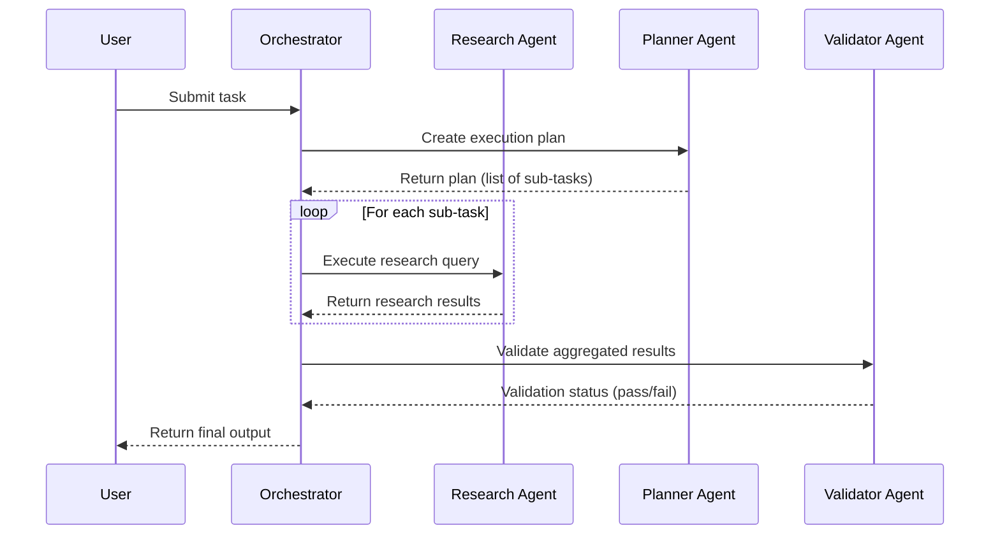
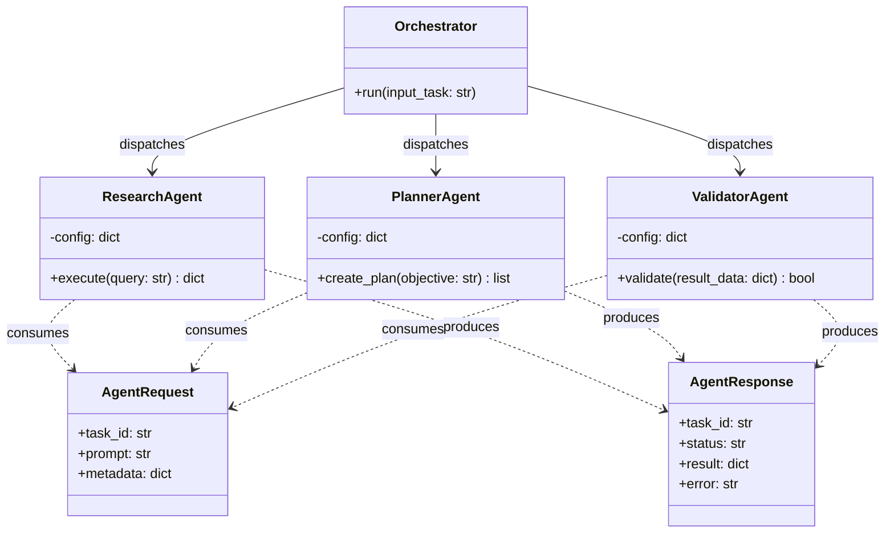

# Multi-Agent AI System

## Software Engineering Course Project Report

---

### Title Page

| Field | Details |
|---|---|
| **Project Title** | Multi-Agent AI System for [Problem Domain] |
| **Course Code** | [CSE XXXX] — Software Engineering |
| **Semester** | [Semester, Academic Year e.g. Fall 2026] |
| **Team Members** | |
| | [Student Name 1] — [Registration Number 1] |
| | [Student Name 2] — [Registration Number 2] |
| | [Student Name 3] — [Registration Number 3] |
| **Faculty Guide** | Prof. [Faculty Name], Department of [CSE/IT], [University Name] |
| **Submission Date** | [DD/MM/YYYY] |

---

## Abstract

> *(150–250 words)*
>
> This project presents the design, development, and evaluation of a Multi-Agent AI System that addresses [problem domain]. The system employs an orchestrator-agent architecture in which a central orchestrator coordinates the execution of specialised autonomous agents — a Research Agent for information gathering, a Planner Agent for task decomposition, and a Validator Agent for output verification and quality assurance.
>
> The project follows the [Agile / Waterfall] software development lifecycle methodology over a 15-week semester. The system is implemented in Python and leverages [LLM APIs / relevant technologies]. Testing encompasses unit, integration, and system-level strategies using the pytest framework, with automated CI/CD via GitHub Actions.
>
> Key outcomes include [placeholder for outcomes — e.g., successful multi-step task orchestration, X% accuracy on benchmark tasks, demonstrated inter-agent communication reliability]. The report documents the complete lifecycle from requirements elicitation through design, implementation, testing, and deployment.

---

## Table of Contents

1. [Introduction](#1-introduction)
2. [Literature Survey / Existing System Analysis](#2-literature-survey--existing-system-analysis)
3. [Software Requirements Specification (SRS)](#3-software-requirements-specification-srs)
4. [System Design](#4-system-design)
5. [Implementation](#5-implementation)
6. [Testing](#6-testing)
7. [Results and Discussion](#7-results-and-discussion)
8. [Project Management Artifacts](#8-project-management-artifacts)
9. [Conclusion and Future Scope](#9-conclusion-and-future-scope)
10. [References](#10-references)
11. [Appendix](#11-appendix)

---

## 1. Introduction

### 1.1 Problem Statement

[Describe the real-world problem that the multi-agent AI system addresses. What gap or inefficiency exists that motivates this project?]

### 1.2 Motivation

[Why is this problem worth solving? What is the academic and practical relevance? Why a multi-agent approach rather than a monolithic solution?]

### 1.3 Objectives

- **O1:** Design and implement a modular multi-agent architecture with a central orchestrator.
- **O2:** Develop specialised agents (Research, Planner, Validator) that perform autonomous sub-tasks.
- **O3:** Establish inter-agent communication protocols and shared data schemas.
- **O4:** Validate system correctness through comprehensive unit, integration, and system testing.
- **O5:** [Additional objective placeholder]

### 1.4 Scope

**In Scope:**
- Orchestrator-driven multi-agent workflow execution
- Research, planning, and validation agent capabilities
- Automated test pipeline via GitHub Actions
- [Additional scope item]

**Out of Scope:**
- Real-time deployment at production scale
- Multi-user concurrent access handling
- [Additional exclusion]

---

## 2. Literature Survey / Existing System Analysis

### 2.1 Existing Systems and Approaches

| S.No. | System / Paper | Approach | Strengths | Limitations |
|-------|----------------|----------|-----------|-------------|
| 1 | [System/Paper Name] | [Brief approach] | [Key strengths] | [Key limitations] |
| 2 | [System/Paper Name] | [Brief approach] | [Key strengths] | [Key limitations] |
| 3 | [System/Paper Name] | [Brief approach] | [Key strengths] | [Key limitations] |
| 4 | [System/Paper Name] | [Brief approach] | [Key strengths] | [Key limitations] |

### 2.2 Gaps Identified

- [Gap 1: e.g., existing systems lack modular agent decomposition]
- [Gap 2: e.g., limited validation/self-correction mechanisms]
- [Gap 3: e.g., lack of shared schema standardisation across agents]

### 2.3 How This Project Addresses the Gaps

[Explain how the proposed multi-agent architecture addresses each identified gap, referencing specific design choices.]

---

## 3. Software Requirements Specification (SRS)

> *Refer to the detailed standalone SRS document at [`docs/SRS.md`](./SRS.md) for the full specification. Key sections are summarised below.*

### 3.1 Functional Requirements

| Req ID | Requirement | Priority | Module |
|--------|-------------|----------|--------|
| FR-01 | The orchestrator shall accept a user task as input and decompose it into sub-tasks. | High | Orchestrator |
| FR-02 | The Research Agent shall retrieve relevant context data given a query. | High | Research Agent |
| FR-03 | The Planner Agent shall generate a multi-step execution plan from a high-level objective. | High | Planner Agent |
| FR-04 | The Validator Agent shall verify outputs against predefined quality constraints and schemas. | High | Validator Agent |
| FR-05 | The system shall pass structured data between agents using shared Pydantic schemas. | Medium | Shared |
| FR-06 | [Placeholder requirement] | [Priority] | [Module] |

### 3.2 Non-Functional Requirements

| Req ID | Category | Requirement |
|--------|----------|-------------|
| NFR-01 | Performance | Agent response time shall not exceed [X seconds] per sub-task under normal load. |
| NFR-02 | Scalability | The architecture shall support addition of new agent types without modifying the orchestrator core. |
| NFR-03 | Reliability | The system shall implement retry logic with exponential backoff for LLM API failures. |
| NFR-04 | Maintainability | All modules shall follow PEP 8 coding standards and include docstrings. |
| NFR-05 | Security | API keys and credentials shall never be hard-coded; `.env` files shall be excluded from version control. |

### 3.3 Use Case Diagrams

> *[Insert Use Case Diagram here — source file at `diagrams/src_diagrams/use_case.puml` or `.drawio`]*
>
> **

### 3.4 Use Case Descriptions

| Use Case ID | UC-01 |
|---|---|
| **Name** | Submit Task to Orchestrator |
| **Actor(s)** | User |
| **Precondition** | System is running; API keys are configured |
| **Main Flow** | 1. User submits a task string. 2. Orchestrator parses and decomposes the task. 3. Orchestrator delegates sub-tasks to agents. 4. Agents return results. 5. Orchestrator aggregates and returns final output. |
| **Postcondition** | User receives aggregated result. |
| **Alternate Flow** | If an agent fails, orchestrator retries or returns partial result with error. |

| Use Case ID | UC-02 |
|---|---|
| **Name** | [Placeholder Use Case Name] |
| **Actor(s)** | [Actor] |
| **Precondition** | [Precondition] |
| **Main Flow** | [Steps] |
| **Postcondition** | [Postcondition] |
| **Alternate Flow** | [Alternate flow] |

### 3.5 Hardware and Software Requirements

**Hardware Requirements:**

| Component | Specification |
|-----------|--------------|
| Processor | Intel i5 / AMD Ryzen 5 or equivalent |
| RAM | 8 GB minimum |
| Storage | 5 GB free disk space |
| Network | Internet connectivity (for LLM API calls) |

**Software Requirements:**

| Component | Specification |
|-----------|--------------|
| Operating System | Windows 10+, macOS 12+, or Ubuntu 20.04+ |
| Programming Language | Python 3.10+ |
| Package Manager | pip / venv |
| Version Control | Git 2.30+, GitHub |
| CI/CD | GitHub Actions |
| Testing Framework | pytest 7.4+ |
| Key Libraries | pydantic, python-dotenv, [LLM SDK] |

---

## 4. System Design

### 4.1 Architecture Diagram

> *[Insert high-level architecture diagram showing Orchestrator, Agents, Shared module, and external APIs]*
>
> **

```
┌─────────────────────────────────────────────────────┐
│                      USER                           │
│                   (Task Input)                      │
└──────────────────────┬──────────────────────────────┘
                       │
                       ▼
┌──────────────────────────────────────────────────────┐
│                  ORCHESTRATOR                        │
│  ┌─────────────┐  ┌──────────┐  ┌───────────────┐   │
│  │ Task Parser  │  │ Workflow │  │ State Manager │   │
│  │             │  │ Engine   │  │               │   │
│  └─────────────┘  └──────────┘  └───────────────┘   │
└──────┬──────────────┬──────────────────┬─────────────┘
       │              │                  │
       ▼              ▼                  ▼
┌────────────┐ ┌────────────┐  ┌──────────────────┐
│  Research   │ │  Planner   │  │    Validator      │
│  Agent      │ │  Agent     │  │    Agent          │
└──────┬─────┘ └──────┬─────┘  └────────┬─────────┘
       │              │                  │
       ▼              ▼                  ▼
┌─────────────────────────────────────────────────────┐
│              SHARED (schemas, utils, config)         │
└─────────────────────────────────────────────────────┘
```

### 4.2 Sequence Diagrams

> *[Insert sequence diagram showing the interaction flow for a typical task execution]*
>
> **

**Example Mermaid Source (for reference):**



### 4.3 Activity Diagram

> *[Insert activity diagram depicting the workflow from task submission to result delivery]*
>
> **

### 4.4 Data Flow Diagrams

#### DFD Level 0 (Context Diagram)

> *[Insert context-level DFD showing external entities and data flows into/out of the system]*
>
> **

#### DFD Level 1

> *[Insert Level 1 DFD showing decomposed processes — Orchestrator, Research, Planner, Validator — and data stores]*
>
> **

### 4.5 Class Diagram

> *[Insert class diagram showing key classes: Orchestrator, ResearchAgent, PlannerAgent, ValidatorAgent, AgentRequest, AgentResponse, Settings]*
>
> **



### 4.6 Database / Data Schema Design

> *[If applicable — insert ER diagram or describe the data persistence layer. For this project, data flows via in-memory Pydantic models; document that here.]*

The system primarily uses in-memory structured data transfer via Pydantic schemas (`AgentRequest`, `AgentResponse`). No persistent relational database is used in the current scope. Intermediate results may be serialised to JSON files for debugging and audit trails.

---

## 5. Implementation

### 5.1 Technology Stack Justification

| Technology | Purpose | Justification |
|------------|---------|---------------|
| Python 3.10+ | Primary language | Widely supported, strong AI/ML ecosystem, team familiarity |
| Pydantic v2 | Data validation & schemas | Type-safe, fast, enforces contracts between agents |
| pytest | Testing framework | Industry standard for Python, rich plugin ecosystem |
| GitHub Actions | CI/CD pipeline | Free for public repos, native GitHub integration |
| python-dotenv | Config management | Secure handling of API keys and environment variables |
| [LLM API SDK] | AI capabilities | [Justification for chosen LLM provider] |

### 5.2 Module-wise Description

#### 5.2.1 Orchestrator (`src/orchestrator/`)

The Orchestrator module is the system's entry point. It receives a user task, coordinates the execution pipeline across agents, manages state transitions, and aggregates final results.

**Key Responsibilities:**
- Task parsing and decomposition
- Agent dispatch and sequencing
- Error handling and retry logic
- Result aggregation

#### 5.2.2 Research Agent (`src/agents/research_agent/`)

[Describe the Research Agent's purpose, input/output contract, and key algorithms or API integrations it uses.]

#### 5.2.3 Planner Agent (`src/agents/planner_agent/`)

[Describe the Planner Agent's purpose, how it breaks objectives into sub-tasks, and any planning heuristics or LLM prompting strategies used.]

#### 5.2.4 Validator Agent (`src/agents/validator_agent/`)

[Describe the Validator Agent's purpose, what quality checks it performs, and how it reports pass/fail status.]

#### 5.2.5 Shared Module (`src/shared/`)

Contains cross-cutting concerns shared by all components:
- `schemas.py` — Pydantic models (`AgentRequest`, `AgentResponse`) defining the inter-agent data contract.
- `utils.py` — Logging setup, retry helpers, and formatting utilities.
- `config.py` — Application settings loaded from environment variables via `pydantic-settings`.

### 5.3 Key Algorithms and Logic

[Describe 2–3 core algorithms or design patterns used in the implementation. Examples: orchestrator routing algorithm, agent selection heuristic, prompt chaining strategy, retry with exponential backoff.]

---

## 6. Testing

> *Refer to the detailed test plan at [`docs/test_plan.md`](./test_plan.md).*

### 6.1 Testing Strategy

| Level | Scope | Tool | Location |
|-------|-------|------|----------|
| Unit Testing | Individual agent methods, utility functions, schema validation | pytest | `tests/test_agents.py`, `tests/test_orchestrator.py` |
| Integration Testing | End-to-end pipeline with mocked LLM responses | pytest | `tests/test_integration.py` |
| System Testing | Full system execution against live/sandbox APIs | Manual + pytest | [Location] |

### 6.2 Test Cases

| Test ID | Module | Test Description | Input | Expected Output | Actual Output | Status |
|---------|--------|-----------------|-------|-----------------|---------------|--------|
| TC-01 | Orchestrator | Orchestrator initialises without errors | N/A | Orchestrator object created | [Fill after testing] | [Pass/Fail] |
| TC-02 | Research Agent | Execute returns structured result dict | `"test query"` | Dict with `status` key | [Fill after testing] | [Pass/Fail] |
| TC-03 | Planner Agent | `create_plan` returns a list | `"test objective"` | `list` instance | [Fill after testing] | [Pass/Fail] |
| TC-04 | Validator Agent | `validate` returns boolean True for valid input | `{}` | `True` | [Fill after testing] | [Pass/Fail] |
| TC-05 | Integration | Full pipeline completes without exception | [Sample task] | Aggregated result | [Fill after testing] | [Pass/Fail] |
| TC-06 | [Module] | [Description] | [Input] | [Expected] | [Actual] | [Status] |

### 6.3 Code Coverage

> *[Insert coverage report summary after running `pytest --cov`]*

---

## 7. Results and Discussion

### 7.1 Screenshots / Sample Outputs

> *[Insert screenshots of system execution, terminal output, or UI if applicable]*
>
> **

### 7.2 Performance Metrics

| Metric | Value | Notes |
|--------|-------|-------|
| Average task completion time | [X seconds] | [Conditions] |
| Agent success rate | [X%] | [Over N test runs] |
| API call efficiency | [X calls per task] | [Average] |
| Test coverage | [X%] | [Via pytest-cov] |

### 7.3 Discussion

[Interpret the results. What worked well? What were unexpected challenges? How do the results compare to the objectives stated in Section 1.3?]

---

## 8. Project Management Artifacts

### 8.1 Gantt Chart / Sprint Plan

> *Refer to the detailed sprint logs at [`docs/sprint_logs.md`](./sprint_logs.md).*

| Sprint | Weeks | Planned Tasks | Assigned To | Status |
|--------|-------|---------------|-------------|--------|
| Sprint 1 | 1–2 | Project setup, SRS draft, repo scaffolding | All | [Status] |
| Sprint 2 | 3–4 | Architecture design, agent interface definitions | [Student Name 1], [Student Name 2] | [Status] |
| Sprint 3 | 5–7 | Core orchestrator + Research Agent implementation | [Student Name 1] | [Status] |
| Sprint 4 | 8–10 | Planner + Validator Agent implementation | [Student Name 2], [Student Name 3] | [Status] |
| Sprint 5 | 11–12 | Integration testing, bug fixes | All | [Status] |
| Sprint 6 | 13–14 | System testing, documentation, report writing | All | [Status] |
| Sprint 7 | 15 | Final submission, presentation prep | All | [Status] |

### 8.2 Task Allocation

| Team Member | Primary Responsibility | Secondary Responsibility |
|-------------|----------------------|-------------------------|
| [Student Name 1] | Orchestrator module, system integration | Architecture design, CI/CD |
| [Student Name 2] | Research Agent, Planner Agent | SRS documentation |
| [Student Name 3] | Validator Agent, testing framework | Test plan, final report |

### 8.3 Risk Analysis

| Risk ID | Risk Description | Probability | Impact | Mitigation Strategy |
|---------|-----------------|-------------|--------|---------------------|
| R-01 | LLM API rate limits or downtime | Medium | High | Implement retry logic with exponential backoff; cache responses during development |
| R-02 | Scope creep due to feature additions | High | Medium | Freeze scope after Sprint 2; use change request process |
| R-03 | Team member unavailability during exams | Medium | Medium | Front-load critical implementation; maintain detailed documentation |
| R-04 | Integration failures between agents | Medium | High | Define shared schemas early; continuous integration testing |
| R-05 | [Risk placeholder] | [Prob] | [Impact] | [Mitigation] |

---

## 9. Conclusion and Future Scope

### 9.1 Conclusion

[Summarise what was achieved. Restate objectives and indicate which were met. Reflect on the software engineering process followed.]

### 9.2 Future Scope

- **Agent Expansion:** Add new specialised agents (e.g., Code Generation Agent, Summarisation Agent) without modifying the orchestrator core.
- **Persistent Memory:** Implement agent memory/context windows for multi-turn task execution.
- **Web Interface:** Build a frontend dashboard for task submission and result visualisation.
- **Production Deployment:** Containerise with Docker and deploy to cloud infrastructure.
- [Additional future scope item]

---

## 10. References

> *Use IEEE format.*

[1] [Author(s)], "[Title]," *[Journal/Conference]*, vol. [X], no. [Y], pp. [XX–YY], [Year]. doi: [DOI].

[2] [Author(s)], "[Title]," *[Journal/Conference]*, [Year]. [Online]. Available: [URL].

[3] [Author(s)], "[Title]," [Publisher], [Year].

[4] Python Software Foundation, "Python 3.10 Documentation," [Online]. Available: https://docs.python.org/3.10/

[5] Pydantic, "Pydantic v2 Documentation," [Online]. Available: https://docs.pydantic.dev/

---

## 11. Appendix

### Appendix A: GitHub Repository

- **Repository URL:** https://github.com/yashg2006/MultiAgent
- **Branch Strategy:** `main` (stable), `develop` (integration), `feature/*` (feature branches)
- **Commit History:** [Refer to repository for full commit log demonstrating version control discipline]

### Appendix B: Environment Configuration

See `.env.example` in the repository root for required environment variables.

### Appendix C: Full Code Listing

> *[If required by the rubric, include full source code listings here. Otherwise, reference the GitHub repository.]*
>
> Full source code is available at the GitHub repository linked in Appendix A. Key modules:
> - `src/orchestrator/main.py`
> - `src/agents/research_agent/agent.py`
> - `src/agents/planner_agent/agent.py`
> - `src/agents/validator_agent/agent.py`
> - `src/shared/schemas.py`

### Appendix D: Meeting Minutes

> *[Refer to `docs/sprint_logs.md` for complete meeting records.]*
